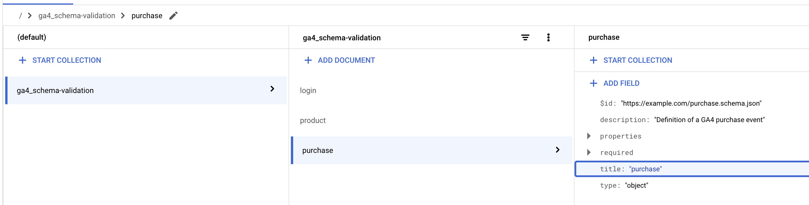

## GA4 Data Contract Event Validation using GTM Server-Side

You can use this variable template for Google Tag Manager Server Side container to validate a Google Analytics 4 request against a Firestore document which contains a JSON schema of validation rules for a given event.

## Repository Structure
<ul>
    <li><b>datalayer-test:</b> example datalayer pushes for certain GA4 events that either pass or fails validation against the example schemas in "schemas"</li>
    <li><b>gtm-templates:</b> contains the raw Javascript code for the GTM variable template (template-code.js). "Firestore Data Contract - Event Validation.tpl" can be imported directly into a GTM Server Side container</li>
    <li><b>images:</b> contains images for this repo</li>
    <li><b>schemas:</b> some example schemas for certain GA4 events and GA4 ecommerce item (product) to be used as reference and starting point</li>
    <li><b>app.py:</b> a basic Python script that imports JSON file(s) from a Google Cloud Storage bucket into a Firestore collection</li>
    <li><b>requirements.txt:</b> dependencies required to run "app.py"</li>
</ul>

## How it works
The image below outlines in high-level how this GTM-SS variable template works. 

 
 

1. The GTM-SS container receives a GA4 request for a single GA4 event from a Web Client-side container.
  
2. In the GTM-SS container, there is a "Transformations - Data Contract Event Validation" transformation setup to augment all events with an additional parameter called "validated_data" (or any other arbitray name).   This parameter will have a value of 1 if an event passes validation or there are no rules setup. It will return 0 if it fails at least one of the validation rules in the provided schema for an event.
  

  
3. The parameter "validated_data" references a "Firestore Data Contract - Event Validation" variable which is the template stored in this repo.
  

 
4. The "Firestore Data Contract - Event Validation" variable calls a Firestore collection (configured in variable settings) and retrieves a Firestore document (containing a schema) if there is one named the same as the GA4 event_name.    For example: if the GA4 event name received from the client-side container is called "purchase", it will query Firestore to return a Firestore document schema which has a title of "purchase" (as per image below)
  

  

5. The variable will then compare the GA4 event payload sent from client-side GTM and compare it against the schema validation rules defined in the relevant Firestore document. It will then return a value of 0 or 1 as outlined in Step 2.
  

Additionally, if the event fails validation against a schema and the variable template has been setup to enable BigQuery logging, it will also insert a new row into a BigQuery table for each validation error that occur.

## Setup

### How to setup variable template

1. Import the "Firestore Data Contract - Event Validation.tpl" file in the "gtm-templates" directory into a GTM Server-Side container.
2. Create a new variable using the imported template in Step 1.
3. Create a new transformation which augments event data values and apply it to any events you would like to add an additional validation parameter. We will assume we have called this: "validated_data" (See the "How it works" section Step 2 for example images)
4. For the "validated_data" parameter, the value should be a reference to the variable in Step 2 (See the "How it works" section Step 3 for example images)
5. (optional) If you would like to enable BigQuery logging of errors, it is assumed that all GA4 events sent from a Client-Side container should contain a parameter "event_id" which has a unique ID value for each event sent. Update all client-side Web GA4 tags to have this paramter.
6. All done!

### Setting up BigQuery Logging for Failed Events

To insert a new row every time an event fails validation against the schema and save the validation error in BigQuery, simply:
1) Create a designated BigQuery table you want to log failed events into, with the following table schema (recommend to partition by ingestion time):
  

2) Tick the "Log Failed Checks into BigQuery?" checkbox in the "Firestore Data Contract - Event Validation" variable settings.

3) Put the details for the BigQuery GCP Project ID, BigQuery Dataset ID and BigQuery Table ID in the variable settings.  

## Supported Data Contracts rules in GTM template
The following validation keywords rules defined in the schema / Firestore document are currently supported by this variable template. These are the rules used to validate the GA4 event payload. These keywords can be used in the schema for each GA4 event you want to validate. See the `schemas` directory for examples of different schemas as a starting point.

- <b>required:</b> paramter must be defined in the GA4 event pyaload
- <b>type:</b> parameter must be of a certain type i.e string, number etc
- <b>pattern (regex):</b> parameter must match the given regex pattern
- <b>minimum:</b> parameter cannot have a value less than the given minimum value
- <b>maximum:</b> parameter cannot have a value greater than the given maximum value
- <b>minLength:</b> parameter cannot have a value with a character length less than the given minimum length
- <b>maxLength:</b> parameter cannot have a value with a character length greater than the given maximum length
- <b>enum:</b> parameter must have a value belonging to the given list of enum values

## Validation for GA4 Ecommerce Items Array

If you would like to validate the structure of individual Item / Product in a GA4 Ecommerce Items Array:

- Define a schema for an individual product / item. An example of this can be found in `schemas/product.schema.json`.
- Make sure the `title` keyword in the Firestore schema is set to `product` as the variable template currently assumes this by default.
- In the schema for the GA4 ecommerce event, under the `properties` keyword add an `items` parameter. An example can be found in `schemas/purchase.schema.json`

## How to import a schema from Google Cloud Storage to Firestore:

Once you have created the schema rules for the GA4 events you want to validate (in the same format as examples in the `schemas` directory), the easiest way to upload them into a Firestore collection is to use `app.py` Python script.

1) Enable the Firestore API in your GCP project.
2) Upload the schemas into a Google Cloud Storage bucket.
2) Authenticate your credentials locally against your GCP account: `gcloud auth login`
3) Install the dependencies: `pip3 install -r requirements.txt`
4) Run the `app.py` Python script in the command line:
`python3 app.py <GCS-BUCKET-NAME> <GCS-FILE-PATH> <FIRESTORE-COLLECTION-NAME> <FIRESTORE-DOCUMENT-ID>`

WHERE arguments are provided as follows:
- `<GCS-BUCKET-NAME>` : Name of the Google Cloud Storage bucket containing the schemas
- `<GCS-FILE-PATH>` : File path to the individual event schema you want to upload into Firestore
- `<FIRESTORE-COLLECTION-NAME>` : Name of the Firestore Collection you want to upload the schema to
- `<FIRESTORE-DOCUMENT-ID>` : Firestore Document ID to upload the schema into. It is recommended to use the same name as the GA4 event_name the schema rule is designed for. For example: if the schema is to validate a GA4 `purchase` event, then we recommend naming it `purchase`

Example: `python3 app.py ga4_schema_registry schemas/purchase.schema.json ga4_schema-validation purchase`